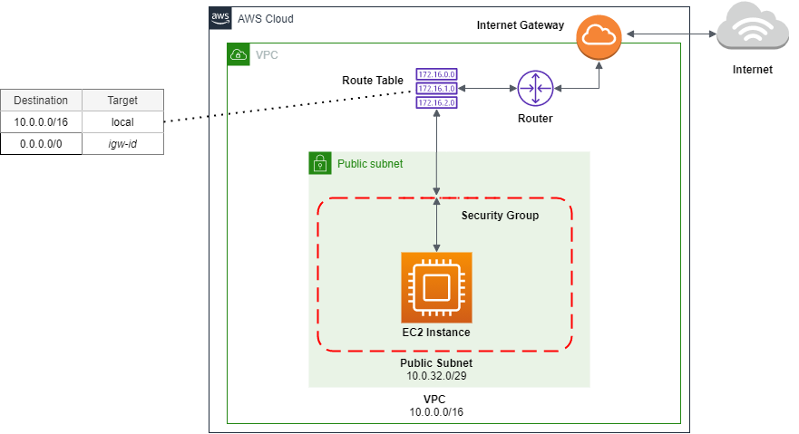

### Diagram

### VPC

In general, AWS creates a default VPC for each AWS region when the account is created.

#### DNS with VPC

Instance in a VPC are provided with public and private DNS hostmnames that correspond to the public IPv4 and private IPv4 addresses for the instance.

- __Private DNS hostnames__: 
    - resolves to the private PIv4 address of the instance
    - can be used for communication between instances in the same network, but not outside the network that the instance is in
    - form: `ip-private-ipv4-address.ec2.internal` for the `us-east-1` region and  `ip-private-ipv4-address.region.compute.internal` for other regions
- __Public DNS hostnames__: 
    - resolves to the public IPv4 address of the instance outside the network of the instance
    - ... and to the private IPv4 address of the instance from within the network of the instance
    - form: `ec2-public-ipv4-address.compute-1.amazonaws.com` for `us-east-1` region and `ec2-public-ipv4-address.region.compute.amazonaws.com` for other regions

DNS supported is determined by the following two attributes:
- `enableDnsHostnames`
- `enableDnsSupport`

Both are apparently enabled by default.

Corresponding (optional) arguments in terraform:
- `enable_dns_hostnames`
- `enable_dns_support`

When both are set to `true`, instances with a public IP address receive corresponding public DNS hostnames and Route 53 Resolver server can resolver AWS provided private DNS hostnames.

More: [DNS support in your VPC](https://docs.aws.amazon.com/vpc/latest/userguide/vpc-dns.html)

### Security Group

Security groups manage traffic at the server level (the resource level).
Security Groups are not for managing higher level groups such as subnets, VPC, or user accounts.  

For SSH connection, set the ports at `22` and `TCP` as protocol.  
For HTTP connection, set the ports at `80` and `TCP` as protocol.  
For HTTPS connection, set the ports at `443` and `TCP` as protocol.

To allow all sorts of traffic, set `protocol="-1"` (i.e. `All`), `from_port` and `to_port` to `0`.
